# Sprinklr-Task-Master

This repo is a Task Manager built with VueJS. It is a very simple and elegant User Interface to manage the projects and 
tasks assigned to team members within those projects. The purpose of this project was to create an application that met the minimum requirements listed below. Each requirement was created to achieve a specific goal.

1. There are two views--one that displays the collection of projects and another that displays the lists and cards for a given project (Vue router)
2. The app uses components to modularize the code (Vue components)
3. Both cards and lists are draggable (Vue directives)
4. Local storage is used and continuously updated to synchronize data across components (Vue watch/data binding)
5. We can create and edit cards, card descriptions, lists, and projects (Vue events)

# Demo
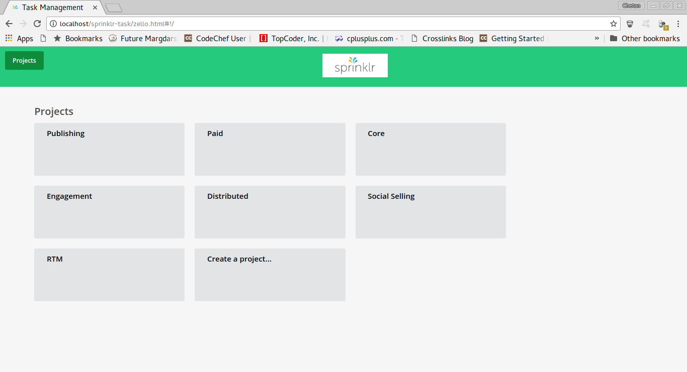
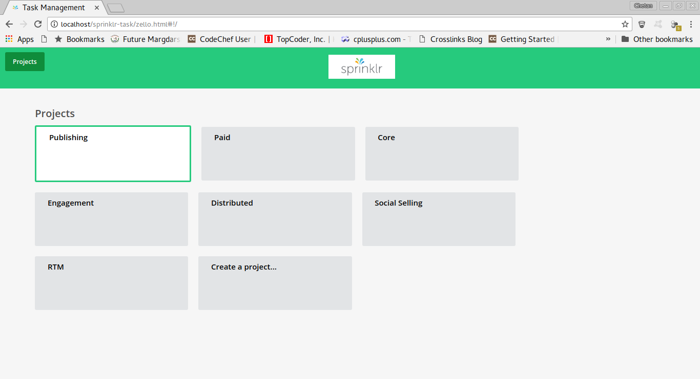

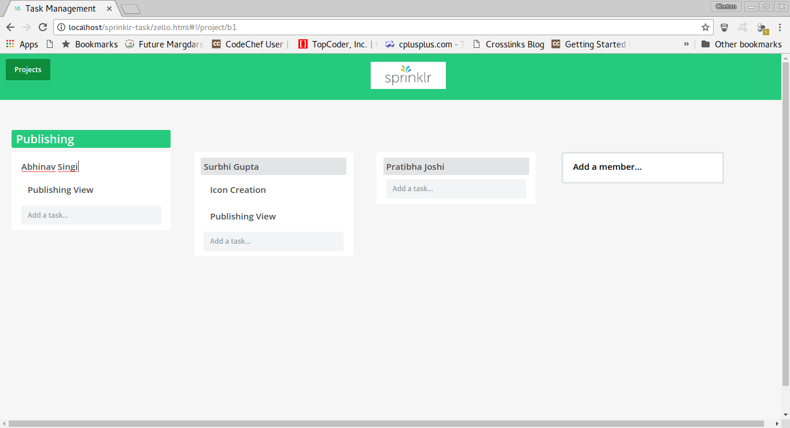
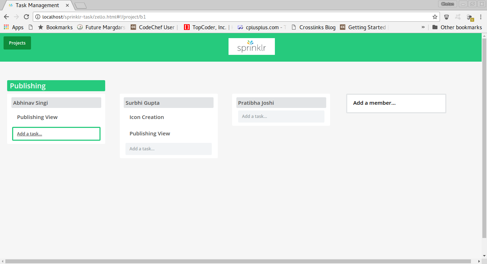
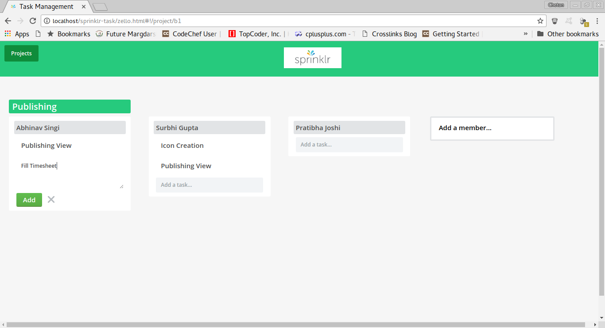
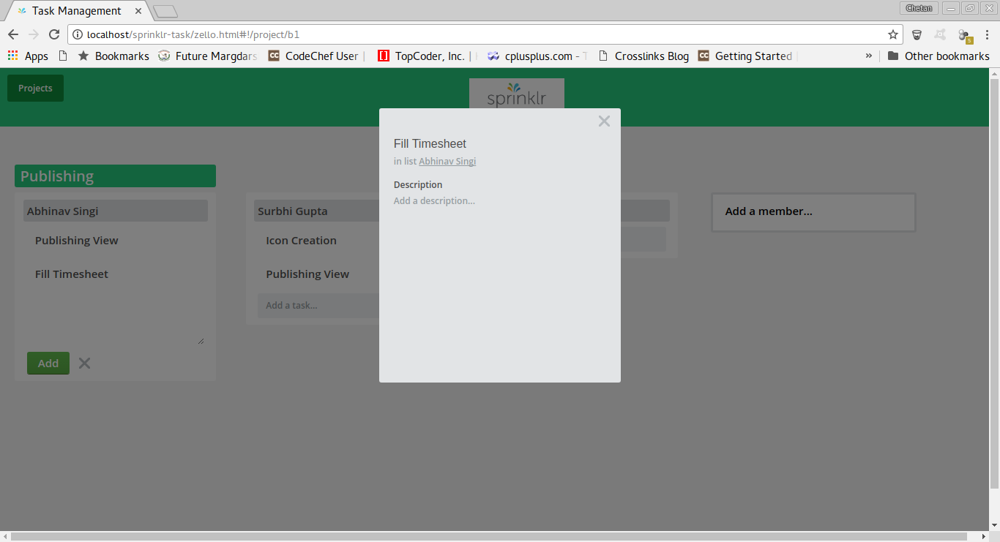
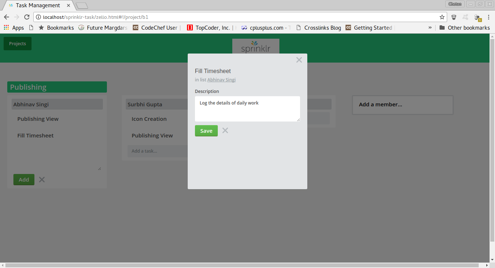
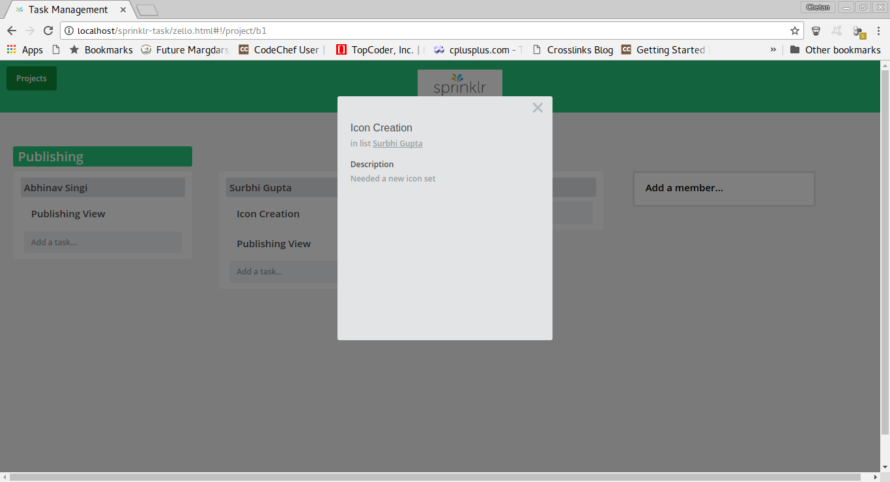
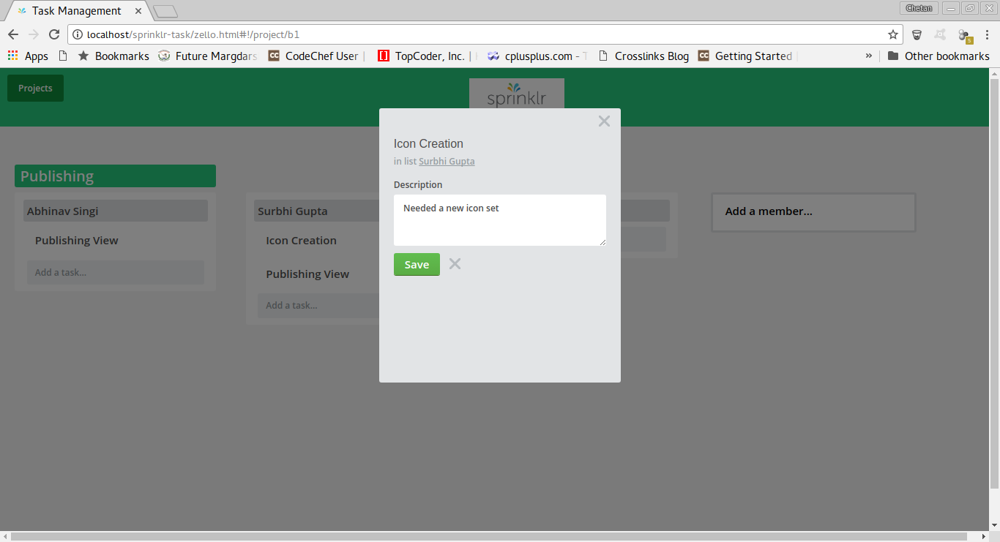
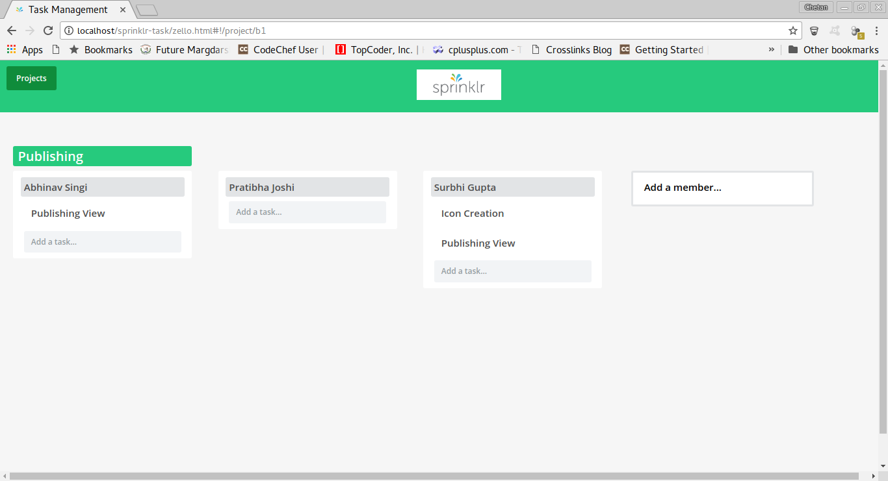

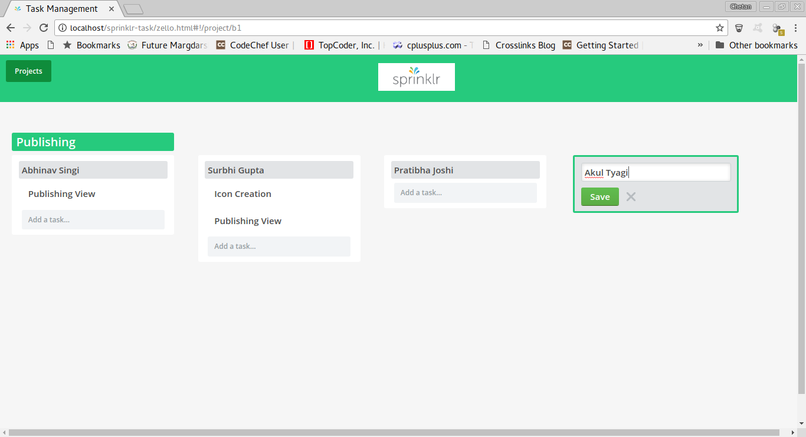
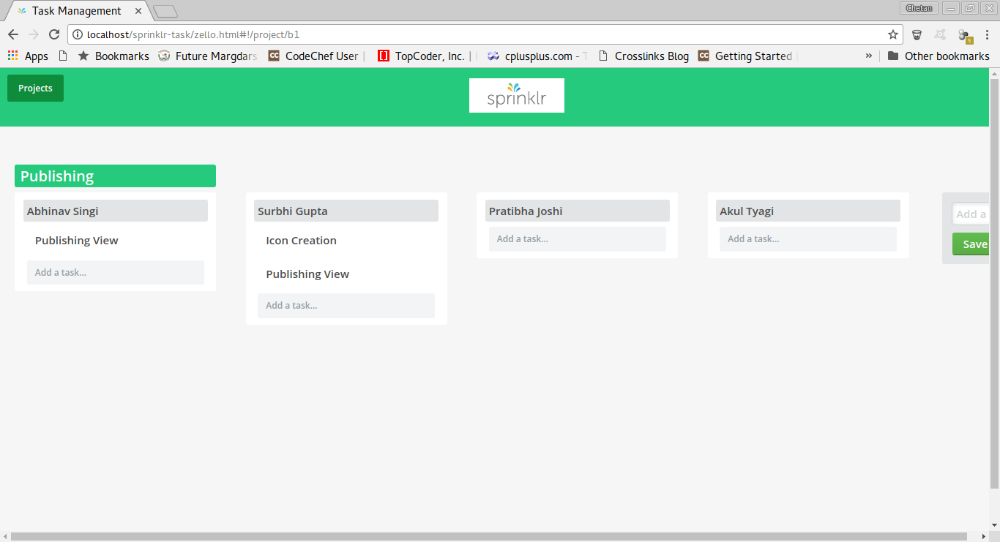
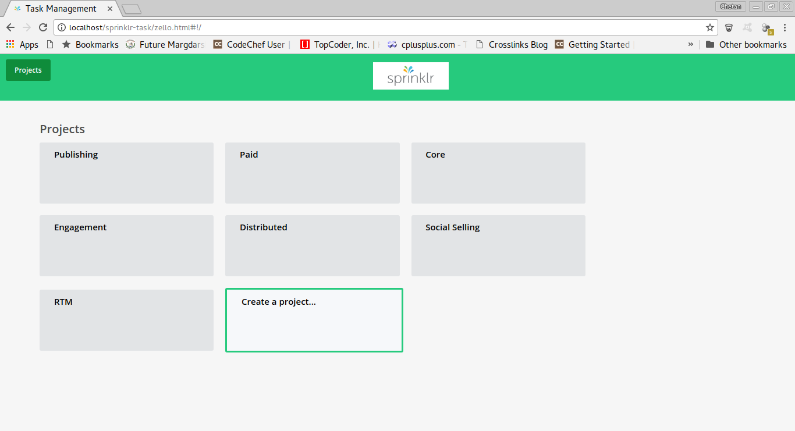
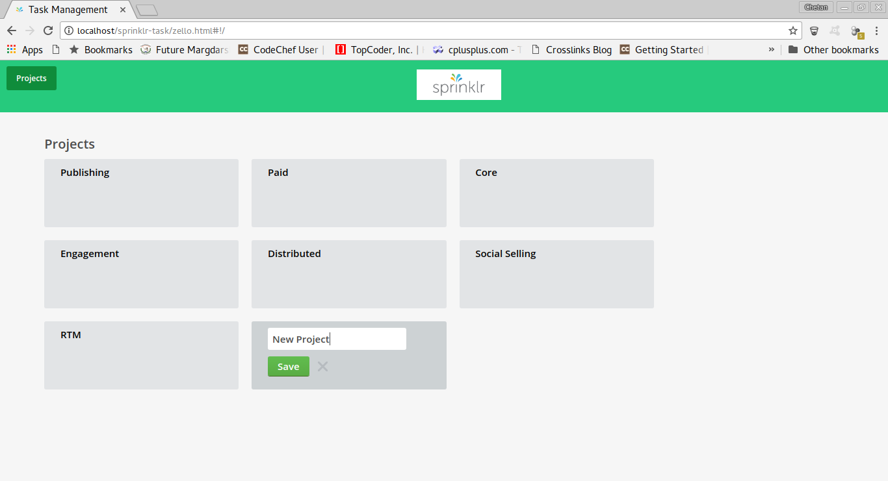
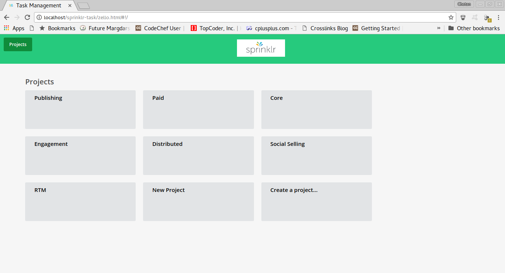
